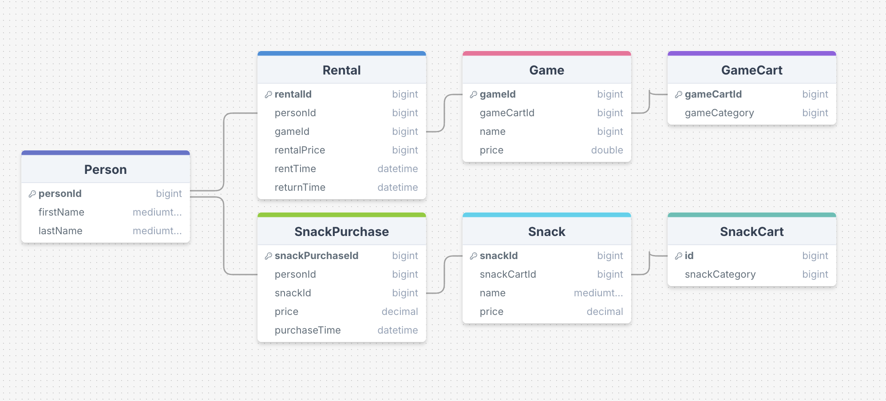

# Board Games

My project includes data relating to board games. There are carts of board games
from which people may rent games, and snack carts to purchase snacks from.





## Query I thought it did well on

**Question**: Were any games NOT returned after being checked out?

**GPT SQL Response**:
```sql
SELECT r.rental_id, p.first_name, p.last_name, g.name
FROM rental r
JOIN person p ON r.person_id = p.person_id
JOIN game g ON r.game_id = g.game_id
WHERE r.return_time IS NULL;
```

**Friendly Response**: It looks like all games checked out have been returned!


## Question that it tripped up on
The SQL syntax it gave didn't have errors, but it misunderstood my question. It
attempted to join the rental and snacks purchased tables, which is on the right
track, but returned an unintelligible answer. Also, it had no way of knowing
what the name of the person was who the answer corresponded to.


Question: Who spent the least amount of money between game rentals and snacks?

**GPT SQL Response**:
```sql
SELECT person_id, MIN(total_spent) AS least_spent
FROM (
    SELECT person_id, SUM(rental_price) AS total_spent
    FROM rental
    GROUP BY person_id
    UNION ALL
    SELECT person_id, SUM(price) AS total_spent
    FROM snack_purchase
    GROUP BY person_id
) AS combined
GROUP BY person_id
ORDER BY least_spent
LIMIT 1;
```

SQL result: [(2, 2.69)]

**Friendly response**: It looks like snacks cost less at $2.69!

The response is friendly sounding, but not helpful or understandable at all.
It's hard to tell what question it's even trying to answer. It should have
included the name of a person and probably how much they spent by combining
the costs of their game rentals and snacks purchased.

## Multi-shot
Ok, with the multi-shot it actually got better! Now, it returned a person's 
name as it should since I asked a "who" question. Also, it answered the question
correctly by returning Jane Smith who did in fact spend the least. The only
thing I could think of to improve would be for the answer to include more 
relevant information such as "she spent the least because she didn't rent any 
board games, she only bought snacks!"

**Question (multi-shot)**: What's the name of the person?

SQL Result: [('Jane', 'Smith')]

**Friendly response**: It looks like Jane spent the least amount of money!

This is a good response. Now what I'd need to do is make it give me that answer without me having to ask multiple questions to it!


## Conclusion
Overall, I'm impressed with chatGPT's capabilities for querying data. It seems 
extremely helpful and fast! However, it still failed to understand some of 
the questions I asked or return relevant data to the question. Honestly though,
I feel like chatGPT is smart enough if I just put more time into engineering the
prompts in more complex ways. One consideration though is that the more data is 
fed into it to make it give correct answers, the more it will cost. I'm interested
how companies go about balancing cost with performance with speed in scenarios like
this.


